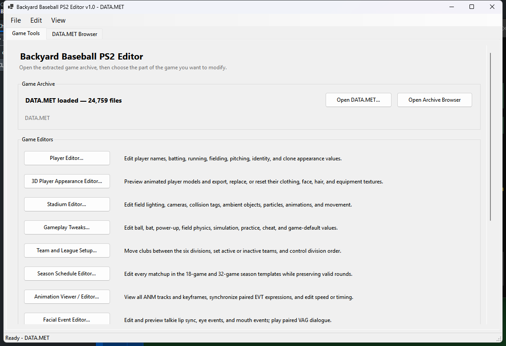
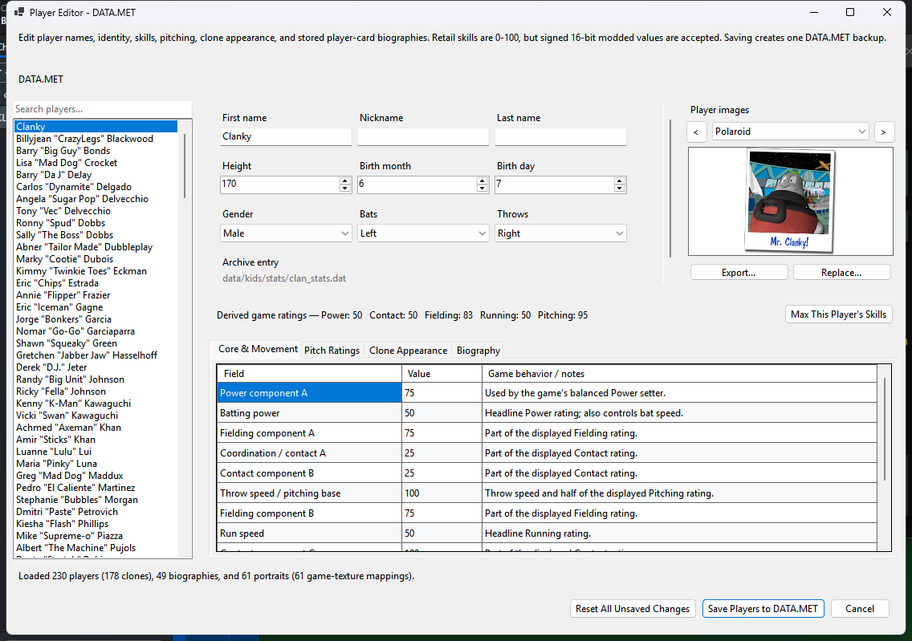
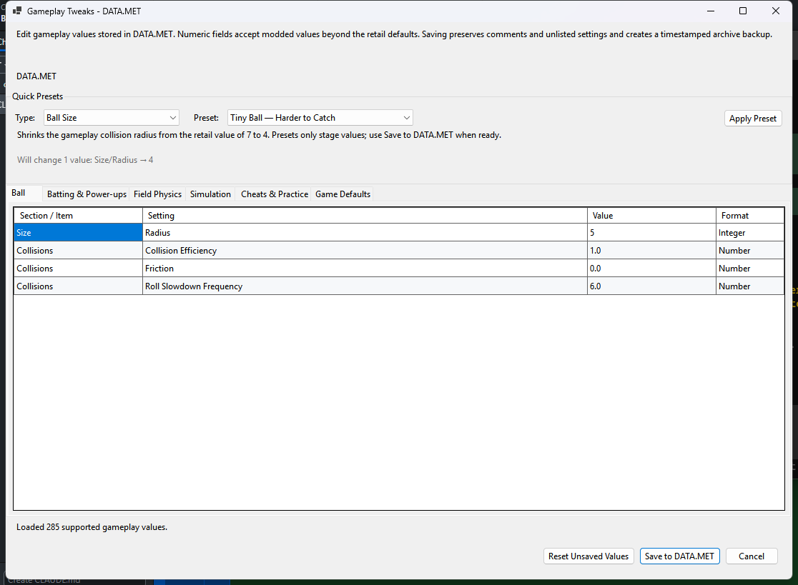
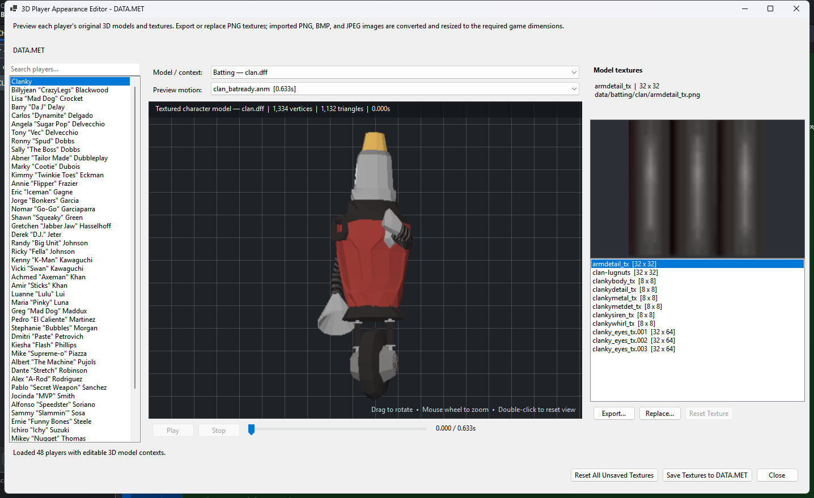
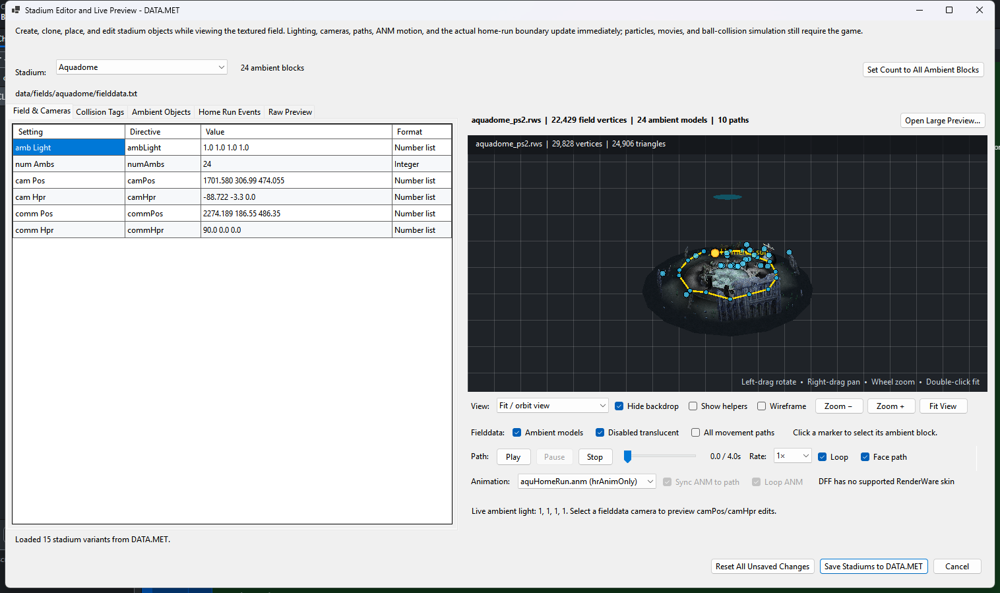

# Backyard Baseball PS2 Editor

A focused Windows modding workspace for Backyard Baseball on PlayStation 2. It provides dedicated
player, gameplay, unlock, and ISO-building tools while retaining an advanced DATA.MET browser for
raw archive work.

## Features

- Edit player identities, ratings, pitches, biographies, portraits, selection videos, and 3D textures.
- Modify stadium lighting, cameras, collisions, ambient objects, paths, animations, and home-run boundaries with a live 3D preview.
- Tune 285 gameplay and physics values directly or apply reversible presets.
- Reorganize teams and divisions and edit all 40 retail season schedule templates.
- Preview and edit RenderWare animations and EVT facial/lip-sync timelines on textured player models.
- Browse and export DFF/RWS models, stadium geometry, textures, PS2 audio, and raw archive files.
- Enable recovered developer options and unlock game content through guarded USA executable patches.
- Rebuild and validate a playable modded ISO from the extracted game folder.

The advanced **DATA.MET Browser** also supports direct text and hex editing plus individual or bulk
import/export. Recognized replacement assets are validated before writing, and modifications create
timestamped backups where applicable.

## Feature screenshots

### Game Tools workspace

| Player Editor | Gameplay Tweaks |
| --- | --- |
|  |  |

| 3D Player Appearance Editor | Stadium Editor and live preview |
| --- | --- |
|  |  |

## Quick start

1. Extract your own Backyard Baseball PS2 ISO with 7-Zip or WinRAR. The folder should contain
   `SYSTEM.CNF`, `DATA.MET`, and the game executable.
2. Open `DATA.MET`, then choose a structured editor from the **Game Tools** tab or use the advanced
   browser for raw archive work.
3. If desired, use **Unlock Game Content** or **Developer Tools** with the verified USA
   `SLUS_208.65`. Executable changes are separate from archive changes.
4. Install ImgBurn, choose **File > Rebuild Game ISO...**, select the extracted folder, and write the
   output ISO outside that folder. The editor uses `ISO9660 + UDF 1.02` and validates the result.

See [ISO rebuilding](docs/ISO_REBUILD.md) for backend and recovery details. Unlock progress normally
belongs to the memory-card `Settings` file; the executable patch instead forces selected content for
every save in the rebuilt ISO. Other executable versions are rejected.

## Research and documentation

Start with the **[game research and technical reference](docs/GAME_RESEARCH.md)** for the verified
retail inventory, game-data architecture, reverse-engineering methodology, major discoveries, known
limits, and a complete documentation index.

Frequently used guides:

- [DATA.MET format and safe resizing](docs/MET_FORMAT.md)
- [Player stats, biographies, portraits, and selection videos](docs/PLAYER_STATS.md)
- [Gameplay tweaks and presets](docs/GAMEPLAY_TWEAKS.md)
- [Stadium environments and home-run boundaries](docs/STADIUM_ENVIRONMENTS.md)
- [Unlocks and memory-card save format](docs/UNLOCKS.md)
- [All focused documentation](docs)
